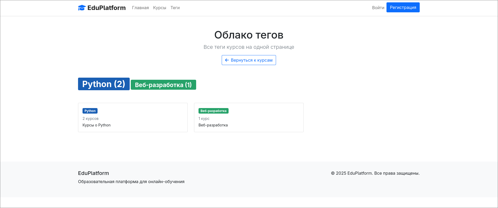
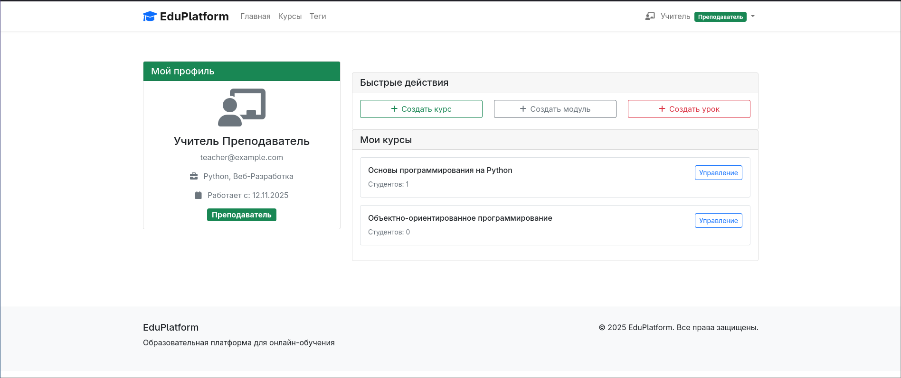
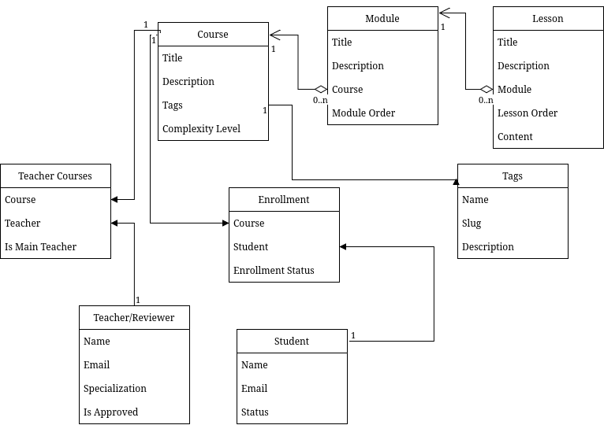
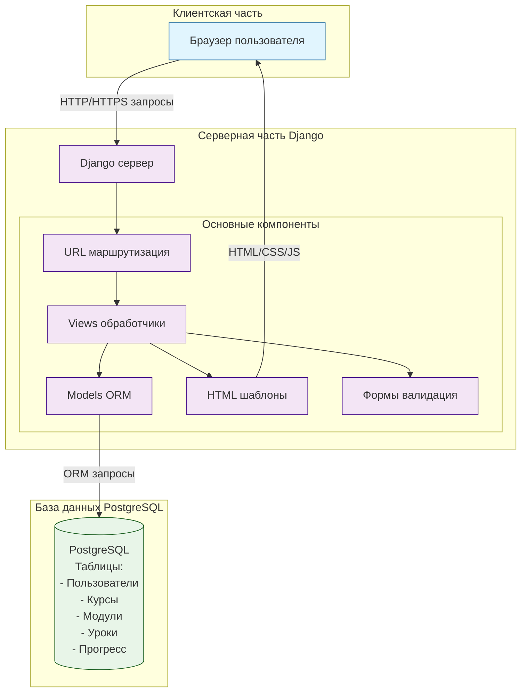

# StudyHub - система курсов для обучения

Проект StudyHub позволяет создавать курсы от лица преподавателей и обучаться курсами преподавателямм

## Features

* Простая и быстрая регистрация
* Возможность создания любых курсов
* Поиск курсов по тегу и названию
* Прогрессия обучения студента

## Tech Stack

* **Бекенд** - Python, Django
* **Database** - PostgreSQL
* **Фронтенд** - Django Templates (HTML, CSS, JS)

## Installation

Для установки проекта, создания виртуального окружения и установки необходимых пакетов нужно:
```bash
git clone https://github.com/Tolex1510/Studyhub.git
cd Studyhub
python3 -m venv .venv
source .venv/bin/activate
pip install -r requirements.txt
```

Также для создания бд нужно использовать команду:

```bash
python manage.py migrate
```

Для запуска проекта нужно использовать команду:
```bash
python manage.py runserver
```

## Screenshots






## ER-диаграмма



## Архитектурная схема

